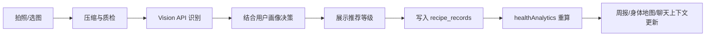

# 食知（FoodSense）功能模块拆解分析

> **产品定位**：智能饮食决策辅助系统，强调「健康状态感知 + 个性化饮食建议」，不提供医疗诊断或治疗功能。  
> **技术形态**：React 移动端 Web 应用（支持 Capacitor 打包 Android、Electron 打包桌面端）+ Express + SQLite 后端 + 多模态大模型能力。

---

## 一、系统架构总览

```
┌─────────────────────────────────────────────────────────────────┐
│                        前端（React + Vite）                       │
│  认证 │ 引导 │ 记录首页 │ 统计 │ 健康报告 │ 画像 │ 小膳青聊天      │
└────────────────────────────┬────────────────────────────────────┘
                             │ /api 代理 → localhost:4001
┌────────────────────────────▼────────────────────────────────────┐
│                     后端（Express + SQLite）                      │
│  用户/资料 │ 食谱记录 │ 目标/偏好 │ 健康分析 │ 提醒 │ 聊天 │ 视觉识别 │
└────────────────────────────┬────────────────────────────────────┘
                             │
┌────────────────────────────▼────────────────────────────────────┐
│              外部能力（可配置 LLM / Vision API）                  │
│         智谱 GLM-4 / OpenAI 兼容接口 / OpenRouter 等              │
└─────────────────────────────────────────────────────────────────┘
```

**导航结构**（底部 Tab）：

| Tab | 页面 | 核心职责 |
|-----|------|----------|
| 记录 | `Home` | 拍照识别、当日摄入、一键记入饮食日志 |
| 统计 | `FoodAnalysis` | 周历视图、历史餐次、营养趋势 |
| 中心 | `MascotChat` | IP 吉祥物「小膳青」对话助手 |
| 健康 | `Tools` | 周报、风险趋势、提醒、下周目标 |
| 我的 | `HealthProfile` | 3D 身体地图、资料编辑、健康目标 |

---

## 二、功能模块拆解

### 模块 1：用户认证与账户体系

**职责**：用户注册、登录、会话状态管理、登出。

| 子功能 | 说明 | 前端 | 后端 |
|--------|------|------|------|
| 注册 | 姓名 + 邮箱 + 密码，密码 bcrypt 加密存储 | `Auth.tsx` | `POST /api/auth/register` |
| 登录 | 邮箱密码校验，返回用户基本信息 | `Auth.tsx` | `POST /api/auth/login` |
| 会话管理 | 登录后加载资料、食谱、目标、偏好 | `App.tsx` | — |
| 登出 | 清空本地状态，回到登录页 | `HealthProfile` | — |

**数据表**：`users`（id, name, email, password, created_at）

**流程**：
```
注册 → 新手引导（Onboarding）→ 首页
登录 → 加载用户数据 → 首页
```

---

### 模块 2：新手引导与健康画像初始化

**职责**：新用户首次使用时，通过对话式问卷收集基础健康画像。

| 子功能 | 采集字段 | 选项示例 |
|--------|----------|----------|
| 健康目标 | `goal` | 减脂瘦身、增肌塑形、体重稳定、提升精力、改善肠胃 |
| 年龄阶段 | `age` | 18-25、26-35、36-50、50 以上 |
| 性别 | `gender` | 女、男、其他 |
| 饮食风格 | `dietStyle` | 清淡少盐、低糖低脂、高蛋白、素食轻食、家常热菜 |
| 今日感觉 | `mood` | 暖心健康、清爽轻盈、轻松不油腻、随性满足 |

**实现要点**：
- 前端 `Onboarding.tsx` 采用分步聊天 UI，每步一问一答
- 完成后调用 `POST /api/profile` 保存，并自动将目标写入 `user_goals`
- 画像数据贯穿后续所有 AI 分析与推荐逻辑

**数据表**：`profiles`（goal, age, gender, dietStyle, mood, height, weight, reminder_settings）

---

### 模块 3：AI 视觉识别与饮食决策（核心）

**职责**：通过拍照识别食物/成分表/外卖订单，结合用户画像给出「今天是否适合吃」的决策建议。

#### 3.1 三种识别模式

| 模式 | 场景 | 后端 mode 参数 |
|------|------|----------------|
| 识别食物 | 正上方拍摄完整菜品 | `food` |
| 拍成分表 | 对准营养成分表/配料表 | `nutrition-label` |
| 外卖订单 | 拍摄外卖订单截图 | `takeout-order` |

#### 3.2 识别流水线

```
用户拍照/选图
    → 前端空白图检测（imageQuality）
    → 图片压缩（compressImage，控制上传体积）
    → POST /api/analyze { email, imageDataUrl, mode }
    → 后端加载用户健康上下文（profile + goals + preferences + records）
    → Vision 模型分析（foodVision.js）
    → 结构化 JSON 返回
    → 前端展示决策等级 + 营养估算 + 风险标签
    → 用户确认后写入食谱记录
```

#### 3.3 决策输出结构

| 字段 | 含义 |
|------|------|
| `foodName` | 菜品名称（中餐场景优化） |
| `recommendation` | `recommended` / `caution` / `not-recommended` |
| `riskTags` | 高盐、高脂、高糖、油炸等 |
| `calories/carbs/protein/fat` | 单份营养估算 |
| `ingredients` | 主要食材 |
| `cookingTechnique` | 烹饪技法（蒸/煮/炒/红烧/油炸等枚举） |
| `summary` + `reasons` | 可解释性说明 |

**相关文件**：
- 前端：`CameraRecognition.tsx`、`Home.tsx`、`compressImage.ts`、`imageQuality.ts`
- 后端：`foodVision.js`、`llmConfig.js`

---

### 模块 4：饮食记录与当日营养追踪

**职责**：持久化每餐记录，并在首页实时汇总当日摄入与目标对比。

| 子功能 | 说明 |
|--------|------|
| 餐次选择 | 早餐 / 午餐 / 晚餐 / 夜宵 / 零食 / 其他 |
| 记录写入 | 识别结果一键加入今日日志，乐观更新 + 失败回滚 |
| 当日汇总 | 热量 + 三大营养素进度条，对比个性化目标 |
| 营养目标 | 基于 BMR/TDEE 公式 + 健康目标系数动态计算 |

**营养目标算法**（`nutritionTargets.js`）：
- Mifflin-St Jeor 基础代谢率（BMR）
- 活动系数 TDEE × 目标系数（减脂 0.85、增肌 1.1 等）
- 蛋白质按体重 g/kg 分配，碳水脂肪按剩余热量拆分

**API**：
- `GET/POST /api/recipes` — 食谱 CRUD
- `GET /api/nutrition/targets` — 个性化每日目标

**数据表**：`recipe_records`（完整营养字段 + recommendation + tags + reasons）

---

### 模块 5：饮食统计与历史回顾

**职责**：以周历/时间线方式回顾饮食历史，辅助用户感知长期趋势。

| 子功能 | 页面/组件 | 说明 |
|--------|-----------|------|
| 周历视图 | `FoodAnalysis.tsx` | 按周切换，每日餐次卡片 |
| 决策等级着色 | 绿/黄/红 | 推荐 / 谨慎 / 不推荐 |
| 营养结构展示 | 进度条、标签 | 单餐与多日聚合 |
| 历史搜索 | `History.tsx` | 按日期分组、搜索过滤（辅助页） |

**特色 UI**：水墨风厨房装饰 SVG（筷子、蒸笼、砂锅），强化中餐文化气质。

---

### 模块 6：健康分析与智能报告

**职责**：基于用户饮食记录，自动生成周报、风险趋势、身体影响分析与可执行建议。

#### 6.1 健康摘要（`healthAnalytics.js`）

| 输出项 | 内容 |
|--------|------|
| `weekSummary` | 本周饮食平衡一句话评价 |
| `balanceScore` | 0–100 平衡分 |
| `streakDays` | 连续记录天数 |
| `mainRiskTags` | 高频风险标签（高盐/高糖/高脂） |
| `riskTrend` | 7 日风险餐次折线数据 |
| `macroTrend` | 热量与三大营养素趋势 |
| `nextWeekGoals` | 下周 2–3 条可执行小目标 |

#### 6.2 身体影响地图（`buildHealthProfile`）

将饮食风险映射到 6 个身体部位抽象状态：

| 部位 | 关注维度 |
|------|----------|
| 头部 | 专注力、餐后困倦 |
| 心脏 | 水肿感、心血管负担 |
| 肠胃 | 消化节律、饱腹感 |
| 骨骼 | 钙质与营养支持 |
| 肌肉 | 代谢、运动恢复 |
| 皮肤 | 油脂平衡、抗氧化 |

每个部位状态：`good` / `mild` / `attention` / `unknown`，并附带推荐食材与原因说明。

#### 6.3 前端展示（`Tools.tsx`）

| 分区 | 内容 |
|------|------|
| 饮食周报 | 平衡分、连续天数、本周小结 |
| 风险趋势 | Recharts 折线/面积图 |
| 健康提醒 | 用药/饮食/复查开关 |
| 下周小目标 | 从分析引擎生成的行动项 |
| 设置与隐私 | 跳转偏好、目标、设置页 |

**API**：`GET /api/health/summary`、`GET /api/health/profile`

---

### 模块 7：智能对话助手「小膳青」

**职责**：以 IP 吉祥物形象提供个性化饮食问答，融合用户全量健康上下文。

| 子功能 | 说明 |
|--------|------|
| 欢迎语 | 首次进入自动生成个性化开场白 |
| 上下文注入 | 目标、偏好、近期餐次、身体关注点、今日任务 |
| 双模回复 | LLM 生成 + 规则兜底（关键词匹配） |
| 语音输入 | Web Speech API，中文识别（`useSpeechRecognition`） |
| 消息持久化 | SQLite `chat_messages` 表 |

**对话可覆盖主题**：
- 问候与目标讨论
- 风险标签解读
- 今日吃什么推荐
- 热量/摄入是否超标
- 身体部位相关饮食建议

**API**：
- `GET /api/chat/messages` — 加载历史（空则插入欢迎消息）
- `POST /api/chat` — 发送消息，返回 user + assistant 双消息

**相关文件**：`MascotChat.tsx`、`ChatThread.tsx`、`chatAssistant.js`

---

### 模块 8：3D 健康画像可视化

**职责**：以非医疗化、抽象化的 3D 人体模型呈现饮食对身体的潜在影响。

| 子功能 | 说明 |
|--------|------|
| 3D 人体模型 | `HumanModel.tsx`（React Three Fiber） |
| 部位高亮 | 点击/选择部位，显示状态徽章与说明 |
| 推荐食材 | 按部位映射友好食物列表 |
| 资料编辑 | 身高体重、饮食风格、今日感觉 |
| 健康目标管理 | 添加/展示个人目标 |

**数据来源**：`GET /api/health/profile` → `bodyImpacts`、`todayTasks`、`focusFoods`

**设计理念**：避免医学术语，用「轻度关注」「需关注」等温和表达，降低用户焦虑。

---

### 模块 9：偏好、目标与提醒设置

**职责**：用户可自主维护饮食偏好、健康目标与提醒开关。

| 子功能 | 页面 | API |
|--------|------|-----|
| 饮食偏好 | `Preferences.tsx` | `GET/POST/DELETE /api/preferences` |
| 健康目标 | `Goals.tsx` | `GET/POST/DELETE /api/goals` |
| 提醒设置 | `Tools.tsx` 弹窗 | `GET/POST /api/reminders/settings` |
| 应用设置 | `Settings.tsx` | 跳转子页面 |
| 关于与免责 | `About.tsx` | 静态内容 |

**提醒类型**：用药提醒、饮食注意、复查提醒（布尔开关，存于 `profiles.reminder_settings` JSON）

---

### 模块 10：节气与季节饮食文化（增值内容）

**职责**：结合中国传统节气与季节，提供文化向的饮食建议（规则数据，非 AI 生成）。

| 组件 | 数据源 | 内容 |
|------|--------|------|
| `SolarTermCard` | `solarTermRecommendation.ts` | 当前节气、宜食/忌食、养生提示 |
| `SeasonalRecommendationCard` | `seasonalRecommendation.ts` | 四季饮食建议、临近节日提示 |
| 部位季节贴士 | `bodyPartFoodRecommendation.ts` | 按身体部位 × 季节的组合建议 |

**使用场景**：`HealthReport.tsx` 等健康报告页作为辅助阅读内容。

---

### 模块 11：健康报告导出

**职责**：将健康数据导出为可分享/存档格式。

| 格式 | 实现 |
|------|------|
| CSV | `exportHealthReportAsCSV` |
| PDF | `exportHealthReportAsPDF`（HTML 渲染） |
| 图片 | `exportHealthReportAsImage` |

**文件**：`healthReportExport.ts`

---

### 模块 12：免责声明与合规体系

**职责**：全链路强调「辅助决策、非医疗诊断」定位。

| 触点 | 组件/页面 |
|------|-----------|
| 首次欢迎 | `WelcomeScreen` |
| 分析结果页 | `DisclaimerNote` |
| 健康画像 | 感知示意说明文案 |
| 关于页 | `About.tsx` 完整免责条款 |

**核心原则**：结果仅供参考，不替代专业医疗咨询。

---

## 三、后端 API 一览

| 分类 | 端点 | 方法 |
|------|------|------|
| 健康检查 | `/api/ping` | GET |
| 认证 | `/api/auth/register`、`/api/auth/login` | POST |
| 用户资料 | `/api/profile`、`/api/user` | GET/POST |
| 食谱记录 | `/api/recipes` | GET/POST |
| 健康目标 | `/api/goals` | GET/POST/DELETE |
| 饮食偏好 | `/api/preferences` | GET/POST/DELETE |
| 健康分析 | `/api/health/summary`、`/api/health/profile` | GET |
| 营养目标 | `/api/nutrition/targets` | GET |
| 视觉识别 | `/api/analyze` | POST |
| 聊天 | `/api/chat/messages`、`/api/chat` | GET/POST |
| 提醒 | `/api/reminders/settings` | GET/POST |

---

## 四、数据模型关系

```
users (1) ──┬── (1) profiles
            ├── (N) recipe_records
            ├── (N) user_goals
            ├── (N) user_preferences
            └── (N) chat_messages
```

**用户健康上下文**（`loadUserHealthContext`）在分析、聊天、识别时统一加载，保证全链路个性化一致。

---

## 五、核心数据流

### 5.1 拍照识别 → 记录 → 分析闭环



### 5.2 个性化上下文注入点

所有 AI 能力共享同一套用户上下文：

- `profile`：年龄、性别、饮食风格、今日感觉、身高体重
- `goals`：健康目标列表
- `preferences`：饮食偏好
- `records`：近期食谱记录（默认取最近数据参与分析）

---

## 六、技术栈

| 层级 | 技术 |
|------|------|
| 前端框架 | React 18 + TypeScript + Vite 6 |
| 样式 | Tailwind CSS 4 |
| UI 组件 | Radix UI + 自定义组件 |
| 图表 | Recharts |
| 3D | React Three Fiber + Three.js |
| 移动端 | Capacitor 8（Android） |
| 桌面端 | Electron 28 |
| 后端 | Express + SQLite3 + bcryptjs |
| AI | 可配置 LLM/Vision（智谱 GLM-4 系列、OpenAI 兼容、OpenRouter） |
| 环境配置 | dotenv（`backend/.env`） |

---

## 七、项目亮点

### 亮点 1：「决策」而非「识别」——可解释的个性化饮食建议

多数食物 App 止步于「这是什么、多少卡」。FoodSense 的核心价值是结合用户目标、近期饮食、身体关注点，输出三级决策（推荐 / 谨慎 / 不推荐）及 `reasons` 原因链，让用户知道「为什么今天适合或不适合」。

### 亮点 2：多模态识别覆盖真实用餐场景

不仅支持拍菜品，还支持拍营养成分表、外卖订单截图，贴近中国用户的外卖与包装食品场景，识别模式与 Prompt 分场景定制。

### 亮点 3：饮食记录 → 身体地图的闭环可视化

`healthAnalytics` 将抽象的营养数据映射到 6 个身体部位的「关注状态」，配合 3D 人体模型交互，把「吃了什么」转化为「对身体可能有什么影响」的直觉感知，且刻意非医疗化表达。

### 亮点 4：IP 化智能助手「小膳青」

中心 Tab 吉祥物入口，聊天融合周报、风险、今日任务等全量上下文；支持语音输入；LLM + 规则双通道保证无 API 时仍可基础应答。

### 亮点 5：科学营养目标 + 文化饮食内容双轨

底层用 BMR/TDEE 计算个性化宏量目标；表层叠加节气、季节、节日饮食建议，兼顾科学性与中国文化认同感。

### 亮点 6：完整的合规与免责设计

从欢迎页到分析页、画像页、关于页，免责声明贯穿全应用，明确辅助工具定位，适合健康管理类产品的合规表达。

### 亮点 7：工程化细节到位

- 图片压缩与空白检测，降低 Vision API 失败率
- 50s 超时与 JSON 修复解析，提升识别稳定性
- 乐观 UI 更新 + 失败回滚（食谱、目标、偏好）
- 单一 `loadUserHealthContext` 保证分析一致性
- 一套代码多端部署（Web / Android / Electron）

### 亮点 8：温暖克制的视觉与交互

浅绿主色、卡片式布局、水墨风中餐装饰、底部圆角 Tab + 中心吉祥物 FAB，整体气质专业但不冰冷，符合「饮食陪伴」而非「病历管理」的产品调性。

---

## 八、模块依赖矩阵

| 模块 | 依赖模块 | 被依赖方 |
|------|----------|----------|
| 认证 | — | 全部需登录功能 |
| 新手引导 | 认证 | 画像、营养目标、AI 分析 |
| AI 识别 | 认证、画像、营养目标 | 饮食记录、健康分析、聊天 |
| 饮食记录 | 认证 | 统计、健康分析、聊天 |
| 健康分析 | 饮食记录、画像、目标 | Tools、HealthProfile、聊天 |
| 小膳青聊天 | 健康分析、饮食记录、画像 | 新手引导（可扩展） |
| 3D 画像 | 健康分析、画像 | 聊天上下文 |
| 偏好/目标/提醒 | 认证 | AI 识别、健康分析、聊天 |

---

## 九、当前边界与扩展方向

| 领域 | 当前状态 | 可扩展方向 |
|------|----------|------------|
| 设备健康数据 | UI 入口预留，未深度集成 | 接入手环/血糖仪数据 |
| 用药提醒 | 开关级提醒，无具体药品管理 | 药品库 + 食物禁忌交互 |
| 离线模式 | 依赖网络与 API | 本地缓存 + 离线规则引擎 |
| 社交分享 | 报告导出已有基础 | 一键分享卡片 |
| 饮食计划 | 目标级建议 | 自动生成一周食谱 |

---

## 十、总结

FoodSense 以 **「拍照识别 → 个性化决策 → 饮食记录 → 健康分析 → 对话陪伴」** 为主链路，将 Vision LLM、营养计算引擎、规则化健康分析与 3D 可视化串联为一体化体验。产品差异化在于：**决策可解释、场景本土化（中餐/外卖/成分表）、身体感知可视化、IP 化交互**，并在全链路贯彻非医疗化的合规表达。

---

*文档版本：2026-06-11 · 基于当前代码库梳理*
