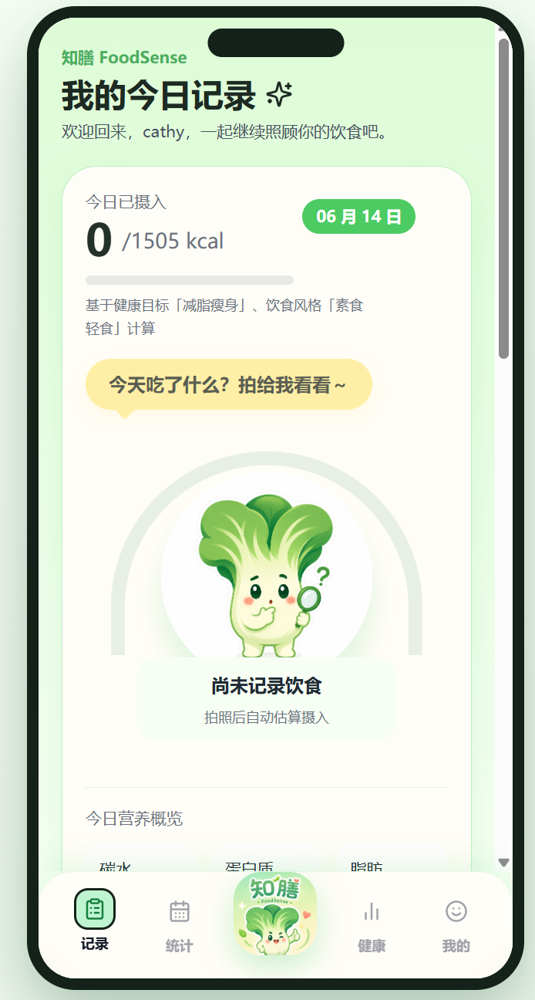

# 🥗 FoodSense

FoodSense 是一个 AI 饮食健康助手，用来记录饮食、识别食物图片、生成饮食建议，并通过健康报告和 3D 健康画像帮助用户更直观地了解饮食状态。✨

## 📸 Demo

<p align="center">
  
</p>

## ✨ 主要功能

- 📷 食物图片识别：识别菜品并估算热量、碳水、蛋白质、脂肪等营养信息。
- 📝 饮食记录：按餐次保存每日饮食，并查看历史记录。
- 🤖 智能建议：结合用户资料、健康目标和饮食记录给出个性化建议。
- 📊 健康分析：生成摄入统计、风险趋势和周饮食报告。
- 🧍 3D 健康画像：用可视化方式展示饮食对身体状态的影响。
- 💻 多端支持：支持 Web、Android 和 Electron 桌面端构建。

## 🛠️ 技术栈

- 前端：React、TypeScript、Vite、Tailwind CSS、Recharts、Three.js / React Three Fiber
- 后端：Node.js、Express、SQLite
- AI：兼容 OpenAI 风格接口，支持文本对话与视觉识别

## 📁 项目结构

```text
FoodSense/
├── backend/              # 后端服务
├── frontend/             # 前端应用
├── mascot/               # 图片与吉祥物资源
├── demo.png              # 项目演示图
├── FUNCTIONAL_MODULES.md # 功能模块说明
└── 系统架构.md           # 系统架构说明
```

## 🚀 快速开始

安装依赖：

```bash
cd backend
npm install

cd ../frontend
npm install
```

启动后端：

```bash
cd backend
npm start
```

启动前端：

```bash
cd frontend
npm run dev
```

默认地址：

- 前端：http://localhost:5173
- 后端：http://localhost:4001

## 🔐 环境变量

如需启用 AI 能力，可在 `backend/.env` 中配置：

```env
LLM_API_KEY=你的_api_key
LLM_BASE_URL=https://open.bigmodel.cn/api/paas/v4
LLM_MODEL=glm-4-flash
VISION_MODEL=glm-4v-flash
PORT=4001
```

未配置 `LLM_API_KEY` 时，项目会使用演示 fallback 结果，方便跑通基础流程。

## 💡 说明

FoodSense 是饮食健康辅助工具，不提供医疗诊断结论。
